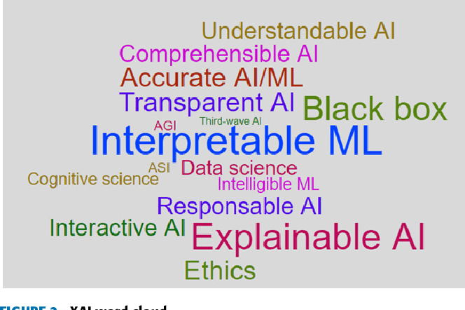

# XAI ( Explainable Artificial Intelligence )

A key impediment to the
use of AI-based systems is that they often lack transparency. Indeed, the black-box nature of these systems
allows powerful predictions, but it cannot be directly explained. This issue has triggered a new debate on
explainable AI (XAI).

Explainable Artificial Intelligence
(XAI) proposes to make a shift towards more transparent AI.
It aims to create a suite of techniques that produce more
explainable models whilst maintaining high performance
levels.

XAI is a research field that aims to make AI systems results
more understandable to humans.
The term was first coined in 2004 by Van Lent et al.,
to describe the ability of their system to explain the behavior
of AI-controlled entities in simulation games application.

While the term is relatively new, the problem of explainability
has existed since the mid-1970s when researchers
studied explanation for expert systems. However,
the pace of progress towards resolving such problem has
slowed down as AI reached an inection point with the spectacular
advances in ML. Since then the focus of AI research
has shifted towards implementing models and algorithms
VOLUME 6, 2018 52139
A. Adadi, M. Berrada: Peeking Inside the Black-Box: Survey on XAI
FIGURE 1. Google trends result for research interest of Explainable Artificial Intelligence  term.
that emphases predictive power while the ability to explain
decision processes has taken a back seat.

Technically, there is no standard and generally accepted
definition of explainable AI. Actually, XAI term tends to refer
to the movement, initiatives, and efforts made in response to
AI transparency and trust concerns, more than to a formal
technical concept. Thus, to put some clarification around
this trend, i quote some XAI definitions as seen by those
who are calling for it. According to DARPA , XAI aims
to ``produce more explainable models, while maintaining a
high level of learning performance (prediction accuracy); and
enable human users to understand, appropriately, trust, and
effectively manage the emerging generation of artificially
intelligent partners''.
