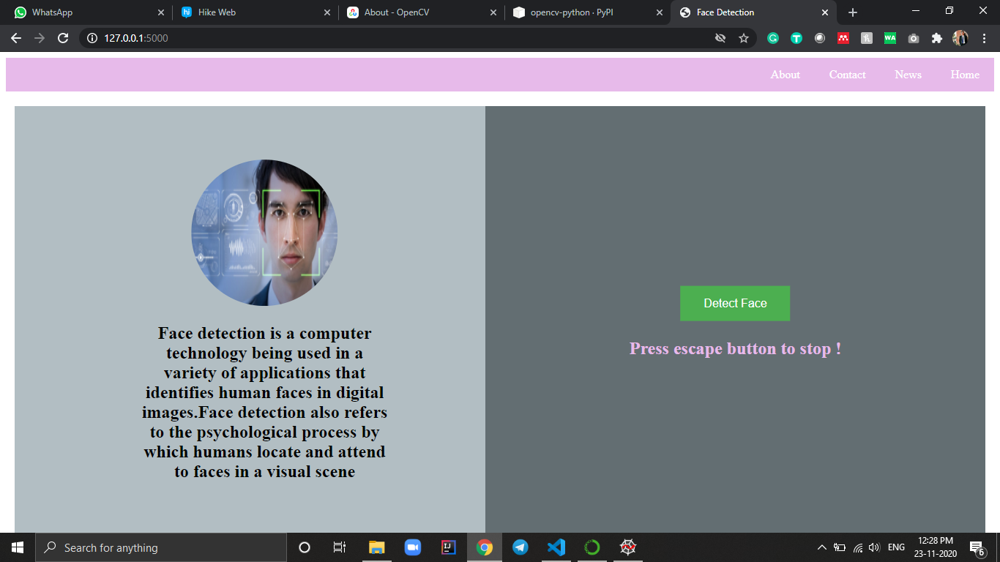
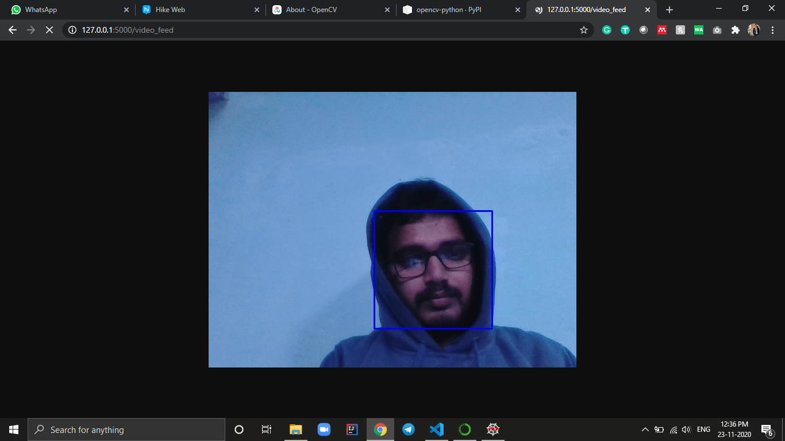

# Project Description 
The project is created using opencv and flask.

## What is flask? 
Flask is a lightweight WSGI web application framework. It is designed to make getting started quick and easy, with the ability to scale up to complex applications. It began as a simple wrapper around Werkzeug and Jinja and has become one of the most popular Python web application frameworks.
___
## What is OpenCv?
OpenCV (Open Source Computer Vision Library) is an open source computer vision and machine learning software library. OpenCV was built to provide a common infrastructure for computer vision applications and to accelerate the use of machine perception in the commercial products. Being a BSD-licensed product, OpenCV makes it easy for businesses to utilize and modify the code. More about [OpenCv](https://opencv.org/about/) .
___
## Get Started
---
### Installation
```python
# install the flask and pymongo 
>>> pip install flask
>>> pip install opencv-python
```

Import the necessary libraries 
```python 
>>> from flask import Flask,Response,request,jsonify
>>> import modal
>>> from flask import Flask,Response,>>> render_template
>>> import cv2

```
> Note : The modal module contain the face detection algorithm.

Create the flask object 
```python
>>> app = Flask(__name__)
```
Add the necessary api required for the proejct
``` python
>>> @app.route('/')
>>> def home():
>>>    return render_template("home.html")
```
>Note the render_template will render the html page into the browser.

# Home page 


# Add another route for the face detection
When the user will click the face detection button in web page it will redirect to the video_feed where the face detection API will be called.

``` python
@app.route('/video_feed')
def video_feed():
    return Response(gen(modal.VideoCamera()), mimetype='multipart/x-mixed-replace; boundary=frame')

```
> Note : gen() method will call the modal module which will connect the webcam and detect the face.

``` python
>>> def gen(camera):
>>>    while True:
>>>        data= camera.get_frame()

>>>        frame=data[0]
>>>        yield (b'--frame\r\n'
               b'Content-Type: image/jpeg\r\n\r\n' + frame + b'\r\n\r\n')

```
> Note: The yield() method is responible for the continues flow of the images.

## Result 


# Description of modal module.

The modal module contain the face detection algorithm and the method to connect webcam with the API.

## Import the library.
``` python
>> import cv2
>> from imutils.video import WebcamVideoStream

```
Face detection and connecting webcam with the browser.
``` python
>>> class VideoCamera(object):
>>>    def __init__(self):
>>>        self.stream = WebcamVideoStream(src=0).start()
    
>>>    def __del__(self):
>>>        self.stream.stop()
    
>>>   def get_frame(self):
        image = self.stream.read()

>>        detector = cv2.CascadeClassifier('haarcascade_frontalface_default.xml')
>>>        gray = cv2.cvtColor(image, cv2.COLOR_BGR2GRAY)

        # Detect the faces
>>>        faces = detector.detectMultiScale(gray, 1.1, 4)

        # Draw the rectangle around each face
>>>        for (x, y, w, h) in faces:
>>>            cv2.rectangle(image, (x, y), (x+w, y+h), (255, 0, 0), 2)

        
            
    # Release the VideoCapture object
    

>>>        ret,jpeg = cv2.imencode('.jpg',image)
>>>        data =[]
>>>        data.append(jpeg.tobytes())
>>>        return data
```

What is Haar Cascade?

[Haar Cascade](https://docs.opencv.org/3.4/db/d28/tutorial_cascade_classifier.html)
  classifiers are an effective way for object detection. This method was proposed by Paul Viola and Michael Jones in their paper Rapid Object Detection using a Boosted Cascade of Simple Features .Haar Cascade is a machine learning-based approach where a lot of positive and negative images are used to train the classifier.

Positive images – These images contain the images which we want our classifier to identify.
Negative Images – Images of everything else, which do not contain the object we want to detect.

##Method Description of VideoCamera class.


| Method | Description |
|---     |---          |
|WebcamVideoStream(src=0).start()| src=0 means we are using the system webcam and start() method will start the webcam.
|stop()  | It will stop the running camere once the esc key is pressed.
| get_frame()| It will the image capture by the webcam after applying face detection.
|           |    